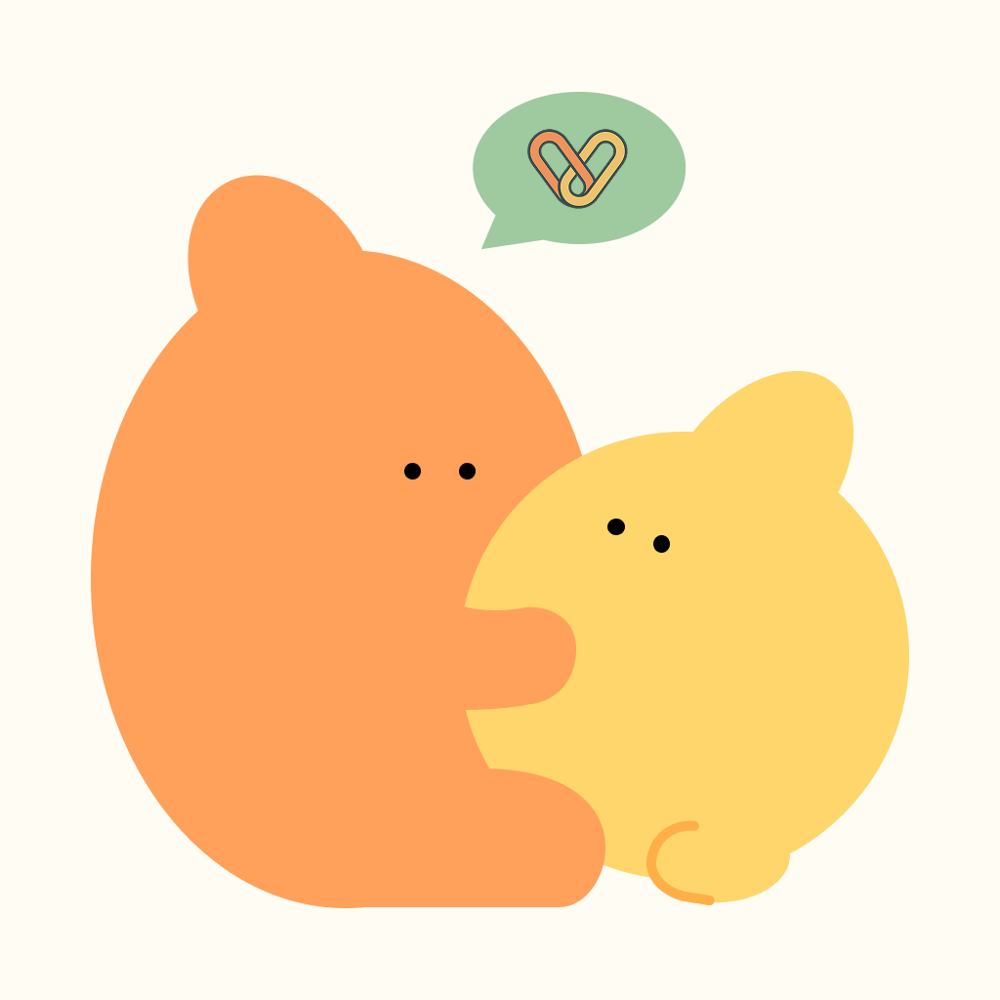
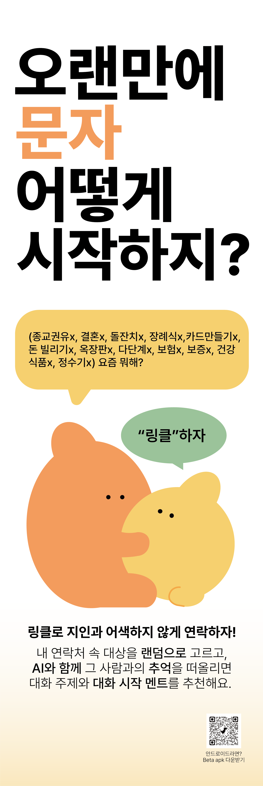

# Linkle!


> **"건강을 날먹한다" - 최소 노력으로 최대 효용을 얻는 관계 관리**

> **2025 APAC Google Solution Challenge 출품작**
> 
<div align="center">
  
</div>

## 💡 프로젝트 배경

"건강을 날먹할 수 있을까?"라는 도발적 상상에서 시작된 프로젝트입니다.

WHO의 건강 정의에 따르면 건강은 **신체적·정신적·사회적** 웰빙을 모두 포함합니다. 신체적 건강은 운동과 식단 관리 없이는 어렵지만, 정신적·사회적 건강은 다를 수 있습니다.

**핵심 아이디어**: 사회적 건강의 핵심인 인간관계 유지를 **"날먹"**(최소 노력으로 최대 효용)하는 방식으로 자동화하자!

## 🌟 솔루션: Linkle

인간관계를 자동으로 리마인드하고 관리해주는 앱입니다.

### 🔄 핵심 흐름

1. **연락처 필터링**: 연락처를 불러와 유효한 관계만 필터링
2. **자동 선택**: 주 1회 또는 격주로 무작위 상대를 선택
3. **질문 프롬프트**: 상대와의 관계를 회상할 수 있는 질문 제공
4. **AI 멘트 전송**: AI가 제안한 멘트 중 하나를 선택해 메시지 앱으로 자동 전송

### ✨ 주요 기능

- **질문 기반 대화**: 다양한 질문을 통해 깊이 있는 대화 시작
- **연락처 관리**: 디바이스 연락처와 연동하여 쉬운 친구 관리
- **메시지 결과**: 대화 결과를 저장하고 관리
- **저장된 타겟**: 자주 연락하는 친구들을 저장하여 빠른 접근

### 🎁 기대 효과

- **사회적 건강**: 관계 유지를 자연스럽게 이어감으로써 사회적 건강 유지
- **정신적 안정**: 내가 누군가에게 여전히 의미 있는 사람임을 인지함으로써 정신적 안정감 확보
- **셀프 테라피**: 일종의 셀프 테라피 효과까지 유도

## 🛠 기술 스택

- **Frontend**: React Native, Expo
- **개발 언어**: JavaScript
- **플랫폼**: iOS, Android
- **상태 관리**: React Hooks

## 📱 화면 구성

- `OnboardingScreen`: 앱 소개 및 사용법 안내
- `QuestionScreen`: 질문 선택 및 표시
- `DeviceContactsScreen`: 연락처 관리
- `MessageResultScreen`: 메시지 결과 확인
- `SavedTargetsScreen`: 저장된 연락처 관리
- `TopicResultScreen`: 주제별 결과 확인

## 🚀 설치 및 실행

### 사전 요구사항
- Node.js (14.0 이상)
- npm 또는 yarn
- Expo CLI
- iOS Simulator 또는 Android Emulator

### 설치
```bash
# 프로젝트 클론
git clone [repository-url]
cd linkle

# 의존성 설치
npm install

# 또는 yarn 사용
yarn install
```

### 실행
```bash
# Expo 개발 서버 시작
expo start

# iOS에서 실행
expo start --ios

# Android에서 실행
expo start --android
```

## 🎯 Google Solution Challenge 2025

이 프로젝트는 **2025 APAC Google Solution Challenge**에 출품된 작품으로, UN의 지속가능발전목표(SDGs) 중 **목표 3: 건강과 웰빙**을 지원합니다. 더 나은 소셜 커뮤니케이션을 통해 사람들 간의 연결을 강화하고 정신적·사회적 웰빙을 증진시키는 것을 목표로 합니다.

## 🤝 기여하기

1. 이 저장소를 Fork합니다
2. 새로운 기능 브랜치를 생성합니다 (`git checkout -b feature/AmazingFeature`)
3. 변경사항을 커밋합니다 (`git commit -m 'Add some AmazingFeature'`)
4. 브랜치에 Push합니다 (`git push origin feature/AmazingFeature`)
5. Pull Request를 열어주세요

## 📄 라이센스

이 프로젝트는 MIT 라이센스 하에 배포됩니다. 자세한 내용은 `LICENSE` 파일을 참조하세요.

## 👥 팀

2025 APAC Google Solution Challenge - KMU-Hipsters

---

**"건강을 날먹하자" - Made with ❤️ for Google Solution Challenge 2025**

<div align="center">
  
</div> 